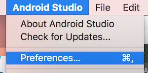

# Android Things Peripherals Tutorial: Extended Instructions #

## About ##

This tutorial explains in detail the instructions for the [Android Things Peripherals I/O Tutorial](https://codelabs.developers.google.com/codelabs/androidthings-peripherals/#0). Please note this tutorial provides instructions for Android Studio based on the application for Mac.
<br/>

## Getting started ##

### Android SDK ###

Before we start with the project, we need to make sure we have the following installed:

- **SDK Tools:** Version 25.0.3 or higher.
- **Android:** Version 8.1 (API 27) or higher.

In order to check or install this, open Android Studio and go to `Preferences`:


<br/>
<br/>

Use the menu to navigate to `Appearance & Behavior > System Settings > Android SDK`


<br/>
<br/>

In the `SDK Platforms` tab, make sure **Android API 27** is installed. If it's not installed, click over the tickbox to select it for installation.


<br/>
<br/>

Go to the `SDK Tools` tab. If any of these are not installed, click over the corresponding tickbox in order to do so:
- **Android SDK Build-Tools:** make sure you have version 25.0.3 or higher. You can check your version by ticking the "Show Package Details" tickbox in the bottom right corner.
- **Android SDK Platform-Tools**
- **Android SDK Tools**


<br/>
<br/>

### Android Things ###

We also need to have a development board with Android Things installed. Follow the official instructions to install Android Things if needed:

- [Raspberry Pi 3](https://developer.android.com/things/hardware/raspberrypi.html)
- [NXP i.MX7D Pico](https://developer.android.com/things/hardware/imx7d.html)
<br/>

### Rainbow HAT ###

You will also need a [Rainbow HAT](https://shop.pimoroni.com/products/rainbow-hat-for-android-things) connected to your board. In order to connect your Rainbow HAT please follow the Rainbow HAT section in the tutorial for the assembly of the Android Things kits below:

- [Raspberry Pi 3](https://developer.android.com/things/hardware/raspberrypi-kit.html)
- [NXP i.MX7D Pico](https://developer.android.com/things/hardware/imx7d-kit.html)
<br/>

## Connecting our device  ##

**Note:** please note the following instructions are to connect the device to a Mac.

Before we create our project we need to check that our device is connected to our computer. We do this by using the [adb tool](https://developer.android.com/studio/command-line/adb.html).

The **adb tool** comes with the Android SDK Platform-Tools package we installed in the previous step.

It is normally installed in the `Android/sdk/platform-tools` or `android_sdk/platform-tools` directories.

Make sure the Android Things device is connected to the computer by USB. Then we will need to open Terminal and run the command below:

```
$ adb devices
```

You should see a message like this:

```
$ adb devices
List of devices attached
1b2f21d4e1fe0129 device
```

If you got this message, skip the rest of this page and continue with the following step.

If you got an error message indicating `-bash: adb: command not found`, please choose one of the two options below to solve the problem:

- **Option 1:** Using Terminal, navigate to the folder where `adb` is installed. This will most likely be: `/Users/_YourUsername_/Library/Android/sdk/platform-tools/`. Once in this location, we can use adb with the command `./adb devices`. We should get a result similar to the one below:

```
$ ./adb devices
List of devices attached
1b2f21d4e1fe0129 device
```


- **Option 2:** We can also add `adb` to our path. This way we won't need to navigate to the location of `adb` each time we want to use this tool. In order to add adb to our path, we need to type the following commands in Terminal. Make sure the path matches the location of your `tools` and `platform-tools` folders:

```
$ export PATH=~/Library/Android/sdk/tools:$PATH
$ export PATH=~/Library/Android/sdk/platform-tools:$PATH
```

After we have done this, we can simply use the command `$adb devices` to get a list of our connected devices:

```
$ adb devices
List of devices attached
1b2f21d4e1fe0129 device
```
