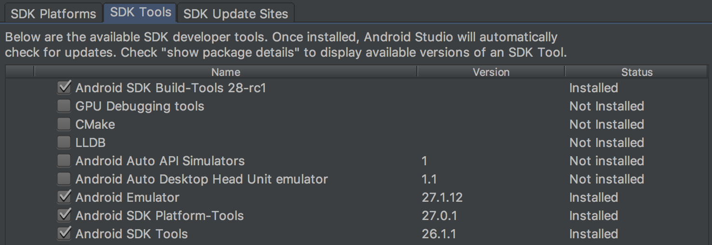

# Android Things Peripherals Tutorial: Extended Instructions #

## About ##

This tutorial explains in detail the instructions for the [Android Things Peripherals I/O Tutorial](https://codelabs.developers.google.com/codelabs/androidthings-peripherals/#0). Please note this tutorial provides instructions for Android Studio based on the application for Mac.
 

## Getting started ##

### Android SDK ###

Before we start with the project, we need to make sure we have the following installed:

- **SDK Tools:** Version 25.0.3 or higher.
- **Android:** Version 8.1 (API 27) or higher.

In order to check or install this, open Android Studio and go to `Preferences`:

Use the menu to navigate to `Appearance & Behavior > System Settings > Android SDK`

In the `SDK Platforms` tab, make sure **Android API 27** is installed. If it's not installed, click over the tickbox to select it for installation.

Go to the `SDK Tools` tab. If any of these are not installed, click over the corresponding tickbox in order to do so:
- **Android SDK Build-Tools:** make sure you have version 25.0.3 or higher. You can check your version by ticking the "Show Package Details" tickbox in the bottom right corner.
- **Android SDK Platform-Tools**
- **Android SDK Tools**

 

### Android Things ###

We also need to have a development board with Android Things installed. Follow the official instructions to install Android Things if needed:

- [Raspberry Pi 3](https://developer.android.com/things/hardware/raspberrypi.html)
- [NXP i.MX7D Pico](https://developer.android.com/things/hardware/imx7d.html)
 

### Rainbow HAT ###

You will also need a [Rainbow HAT](https://shop.pimoroni.com/products/rainbow-hat-for-android-things) connected to your board. In order to connect your Rainbow HAT please follow the Rainbow HAT section in the tutorial for the assembly of the Android Things kits below:

- [Raspberry Pi 3](https://developer.android.com/things/hardware/raspberrypi-kit.html)
- [NXP i.MX7D Pico](https://developer.android.com/things/hardware/imx7d-kit.html)
